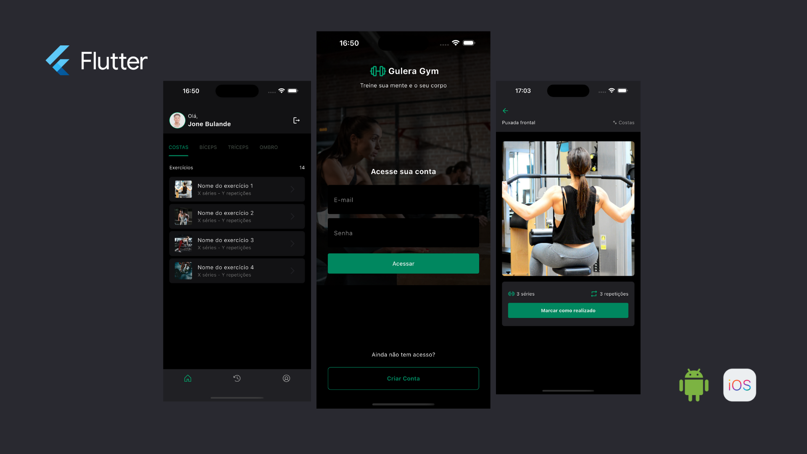

# 🏋️‍♂️ Gulera — App de Ginásio em Flutter

<p align="center">
  
</p>

Gulera é a recriação em **Flutter** da interface do app **Ignite Gym**, originalmente desenvolvido num curso da Rocketseat em **React Native**.  
Decidi construir a UI do zero em Flutter como forma de estudo, prática e aperfeiçoamento das minhas skills em desenvolvimento mobile.

O nome **“Gulera”** é uma gíria usada para descrever alguém musculado, forte e atraente — perfeito para um app relacionado a treinos e fitness. 💪🔥

---

## 📌 **Descrição**

O Gulera é um app focado na experiência visual, inspirado diretamente no design do Figma do Ignite Gym.  
Este projeto tem como objetivo treinar:

- Estrutura de widgets  
- Organização de pastas   
- Navegação  
- Leitura de design e replicação fiel no Flutter  
- Boas práticas de UI/UX  

Neste momento é um projeto de **UI**, mas poderá futuramente incluir lógica, autenticação, backend e interações reais.

---

## ✨ **Funcionalidades atuais (UI)**

- Tela inicial com design fiel ao Figma  
- Componentes reutilizáveis  
- Layout responsivo  
- Estrutura organizada de widgets  
- Suporte a iOS e Android  
- Preparo para futura integração com Firebase ou API

> ⚠️ **Nota:**  
> A versão atual foca apenas na interface e componentes visuais.  
Funcionalidades reais serão implementadas nas próximas versões.


---

## 🚀 **Tecnologias Utilizadas**

- **Flutter**  
- **Dart**  
- Material Design  
- VS Code 
- Emulador iOS / Android  

---

## 🔧 **Como executar o projeto**

1. **Clone o repositório:**

```bash
git clone https://github.com/JoneBulande/gulera.git
